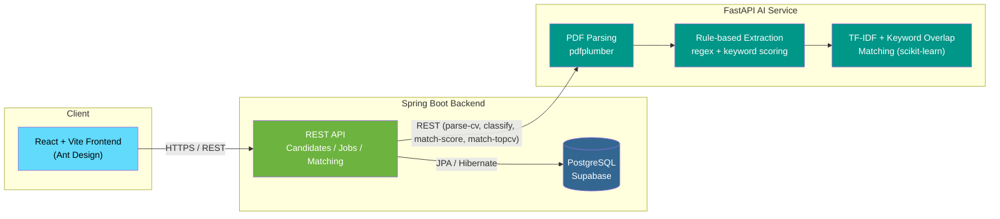

# AI Recruitment Assistant

An end-to-end recruitment platform that automates CV parsing, rule-based information
extraction, and CV-to-Job-Description matching for the Vietnamese IT job market.

**🔗 Live Demo:** [cv-generator-project-umber.vercel.app](https://cv-generator-project-umber.vercel.app)
**🔧 Backend API:** [cv-generator-project.onrender.com](https://cv-generator-project.onrender.com)
**🤖 AI Service:** [cv-ai-engine.onrender.com](https://cv-ai-engine.onrender.com)

---

## Overview

Recruiters spend hours manually screening CVs against job requirements. This project
automates part of that pipeline: candidates upload a CV (PDF), the system extracts
text and structured fields, classifies the candidate's likely industry and target
position with keyword-based rules, and computes a match score against job postings —
so both candidates and HR can see fit at a glance.

## Architecture



## Luồng nghiệp vụ

Hệ thống hỗ trợ 2 vai trò riêng biệt:
1. **Ứng viên (Candidate):** Đăng ký/Đăng nhập → Upload CV (PDF) cho từng vị trí muốn
   ứng tuyển (có thể ứng tuyển nhiều vị trí, mỗi lần upload là 1 hồ sơ riêng) → Xem
   dashboard các vị trí đã ứng tuyển và % phù hợp với từng job gợi ý.
2. **Nhà tuyển dụng (HR):** Đăng ký (yêu cầu email đúng domain công ty nếu công ty nằm
   trong danh sách xác thực) → Tạo tin tuyển dụng → Xem danh sách ứng viên xếp hạng
   theo điểm phù hợp.

*Mật khẩu được hash bằng BCrypt. Token đăng nhập là UUID ngẫu nhiên, có hạn 24h kể từ
lúc cấp (xem `AuthUtil`), không phải JWT chuẩn.*

**Request flow (CV upload → match score):**
1. User uploads a CV (PDF) via the React frontend.
2. Spring Boot forwards the file to the FastAPI AI service (`/parse-cv`).
3. FastAPI extracts text (`pdfplumber`) and classifies industry & position using
   keyword-count rules with a minimum-match threshold (not a trained ML classifier).
4. Backend persists the CV upload as a new application record and triggers TopCV
   crawling + scoring once, storing the result (no longer re-crawled on every page
   view — see Known Limitations below for the history of this bug).
5. Matching combines TF-IDF cosine similarity (with Vietnamese+English stopwords and
   bigrams) and an explicit keyword-overlap ratio, weighted 55/45, instead of raw
   TF-IDF alone.

## Tech Stack

| Layer | Technology |
|---|---|
| Frontend | React 19, Vite, Ant Design, Axios |
| Backend | Spring Boot, Spring Data JPA, HikariCP |
| AI Service | FastAPI, scikit-learn (TF-IDF + cosine similarity), regex-based rule engine |
| Database | PostgreSQL (Supabase) |
| CV Parsing | pdfplumber |
| Job sourcing | TopCV crawl (BeautifulSoup) with a labelled demo-data fallback when crawling fails |
| Infrastructure | Docker Compose, Render (backend + AI service), Vercel (frontend) |

## Key Features

- 📄 **PDF CV parsing** — extracts raw text via `pdfplumber`
- 🏷️ **Rule-based classification** — keyword-count rules (with a minimum-score
  threshold) predict candidate industry and target position; not a trained model
- 🧮 **Hybrid TF-IDF matching** — TF-IDF cosine similarity (bigrams, VN+EN stopwords)
  blended with explicit keyword overlap, replacing an earlier ad-hoc log-scaling hack
- 📊 **Candidate dashboard** — lists every position applied to, with the top match %
  per application; **HR dashboard** — ranked candidates per job posting
- 🌐 **Bilingual text handling** — regex and stopword lists cover both English and
  Vietnamese CV/JD text (not a multilingual embedding model)

## Known Limitations & Design Trade-offs

Documented honestly here rather than glossed over, since these came up during a code
review pass and are worth being able to explain in a defense:

- **No trained ML model.** Industry/position classification and matching are all
  rule-based (regex keyword counts) or classical TF-IDF — not the SVM/sentence-
  embedding pipeline an earlier draft of this README implied. This was a deliberate
  scope decision for a 7-week capstone deployed on Render's free tier (loading a
  ~400-500MB multilingual embedding model risks exceeding the free tier's RAM).
- **Auth is a custom UUID token, not JWT.** Simple to implement in the time available;
  trade-off is it must be looked up in the DB on every request (no self-contained
  claims) and doesn't support refresh tokens. It now expires after 24h (see
  `AuthUtil`), which the first version did not.
- **No centralized auth filter.** Token verification is a shared `AuthUtil` bean
  called from each controller rather than a single Spring Security filter — reduces
  duplication compared to the original per-controller copies, but a filter/interceptor
  would still be the more idiomatic Spring approach.
- **TopCV crawling is fragile by nature.** It scrapes HTML (no public API exists for
  this), so it breaks if TopCV changes their markup. When crawling fails, the system
  falls back to clearly-labelled demo job listings (`source: "DEMO"` in the API
  response) instead of silently mixing them with real postings.
- **No automated tests yet.** Test coverage is the most significant gap remaining.

## Local Development

```bash
# 1. AI Service (FastAPI) — port 8000
cd ai-service
python -m venv venv && venv\Scripts\activate   # Windows
pip install -r requirements.txt
uvicorn main:app --reload --port 8000

# 2. Backend (Spring Boot) — port 8080
cd backend-service
./mvnw spring-boot:run

# 3. Frontend (React + Vite) — port 5173
cd frontend
npm install
npm run dev
```

Open `http://localhost:5173` to run the app locally. When running via Docker Compose,
set `VITE_API_BASE_URL` (already wired in `docker-compose.yml`) so the frontend talks
to your local backend instead of the production Render deployment.

If you're pulling this update into an existing deployment, run
`backend-service/src/main/resources/db/migration_dashboard.sql` once against your
Postgres/Supabase database — Hibernate's `ddl-auto` won't drop the old unique
constraint on `candidates.email` or create the new `application_matches` table for you.

## Project Status

Capstone project built over a 7-week timeline, covering the full pipeline from data
preparation and NLP-adjacent rule design to full-stack deployment. Currently deployed
and functional end-to-end (see live demo above).

## License

This project was built as an academic capstone project and is available for
educational reference.
